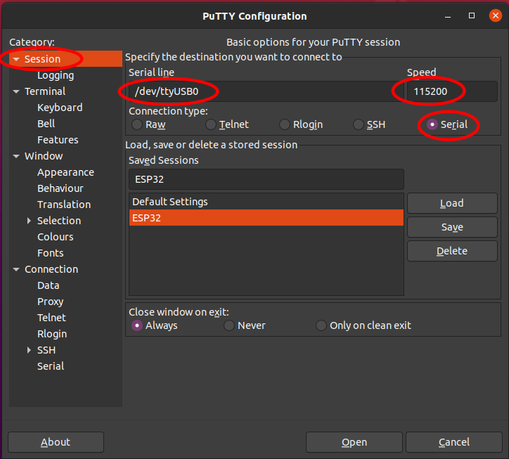
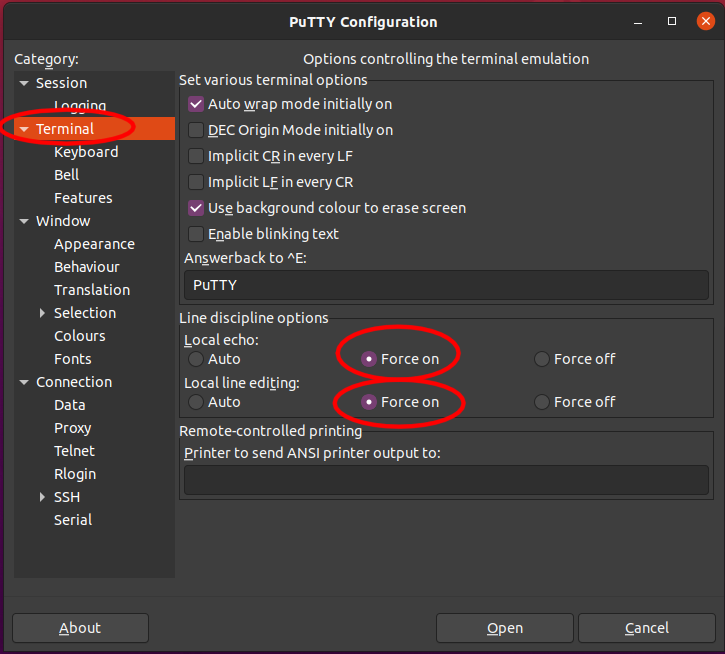

# Micro Invaders Firmware

This repository contains firmware for the [robots](https://github.com/robot-uprising-hq/ai-robot-hardware) that can be used in [Micro Invader competition](https://github.com/robot-uprising-hq/ai-guide).

This firmware supports sending motor commands over Wifi. The commands are seralized with Protocol buffers.

You are free to tweak this code to code to work in any way you wish to improve the performance of your project.

Built using latest [Espressif IoT Development Framework](https://github.com/espressif/esp-idf), at the time of writing `release/v4.2`.

The firmware works well with [ai-simulator](https://github.com/robot-uprising-hq/ai-simulator) simulator.

There is also another alternative firmware for the robot, [ai-robot-udp](https://github.com/robot-uprising-hq/ai-robot-udp), which uses simple enconded UDP messages for the communcation. It works well with [zero-ones-simulated](https://github.com/zero-ones-given/zero-ones-simulated).

## Installation

Please check [ESP-IDF docs](https://docs.espressif.com/projects/esp-idf/en/latest/get-started/index.html) for getting
started instructions.

I suggest creating a virtual environment with python.

```shell script
% python3 -m venv ve
% . ve/bin/activate
```

The ESP tools are installed by running `install.sh` from the esp-idf repository.

After installing the python environment, if running the `. export.sh` gives you grief about missing packages, you can
try to install exact versions of the packages -- I got it to work with

```shell script
pip install 'pygdbmi==0.9.0.2' 'gdbgui==0.13.2.0'
```

## Running on the robot

Plug the USB cable to your robot and optionally note down the USB tty device.

```shell script
(ve)% idf.py flash monitor
```

Sometimes the port does not open, in which case the above command might auto-detect, e.g., your phone or something
and the command will stall while trying to connect to the (non-ESP32) device. In these cases it is nice to have the
port specified for the command, and it will fail immediately, allowing you to notice the situation and remove the USB
cable to try again.

## Configuring and communicating with the robot

After flashing, the robot can be communicated and configured using a terminal, like `picocom`, or the above monitor
command, when connected with USB. Type `help` for online help. The robot can be configured with SSID and password to
connect persistently to a given WiFi network.

## Re-creating the protocol code

Use `ai-xxx` repository script `xxx` (or check how the script works) to regenerate the protocol files in the
`udpcomm` component of this project (see `components/udpcomm`).

## LED specification

TODO: LED handling not implemented yet

WiFi LED will indicate connectivity state.

- off
- blinking
- constantly lit

is lit if WiFi is connected and the device has received an IP-address, it will be off otherwise.

## License boilerplate

_Code in this repository is in the Public Domain (or CC0 licensed, at your option.)
Unless required by applicable law or agreed to in writing, this
software is distributed on an "AS IS" BASIS, WITHOUT WARRANTIES OR
CONDITIONS OF ANY KIND, either express or implied._

---

# Docker in development

## Docker compile

docker run --rm -v \$PWD:/project -w /project espressif/idf:release-v4.2 idf.py build

## Docker menuconfig to edit defaults settings for WIFI and motor

docker run --rm -it -v \$PWD:/project -w /project espressif/idf:release-v4.2 idf.py menuconfig

## Docker flash

docker run --rm --privileged -v /dev:/dev -v \$PWD:/project -w /project espressif/idf:release-v4.2 idf.py -p /dev/ttyUSB0 flash

---

# Serial communication with the ESP32

Setup serial communication to ESP32 with Putty.



Configure Putty to show input user types.



### Available commands for AI Robot ESP32

| Command           | Action                                       |
| ----------------- | -------------------------------------------- |
| help              | Show this help                               |
| scan              | Do a quick Wifi AP scan.                     |
| query             | Show configuration.                          |
| query all         | Show all configuration, including passwords. |
| set ssid SSID     | Set WiFi AP to use to SSID.                  |
| set passwd PASSWD | Set Wifi password to PASSWD.                 |
| udpsrvstart       | Start UDP server.                            |
| wifistart         | (Attempt to) start WiFi.                     |
| wifistop          | Disconnect from WiFi.                        |
| motortest         | Run simple test of the motors.               |
| quit              | Exit command-loop (mainly for debugging).    |
